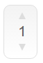
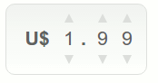

# react-number-picker
Simple React component to pick/select a number. Can be a price selector too, if you specify `currency`.

It's a way of forcing the user to choose a valid number, without using masks.

##Screenshots






##Install

`npm install react-number-picker --save`

##Usage

```js
import React from "react";
import ReactDOM from "react-dom";

import NumberPicker from "react-number-picker";

import "react-number-picker/dist/style.css"

const Wrapper = class Wrapper extends React.Component {
	constructor(props) {
		super(props);
		this.state = {
			value: 1.99
		}
	}

	handleChange(new_value) {
		console.log("new value", new_value);
		this.setState({value: new_value});
	}

	render() {
		return <NumberPicker 
			value={this.state.value}  
			onChange={this.handleChange.bind(this)}
			/>;
	}
};

export default Wrapper;

ReactDOM.render(<Wrapper />, document.getElementById("app") );
```

##Styling

Don't forget to require/import `style.css` from `"react-number-picker/dist/style.css"`.

You can copy and customize this file. If you do some nice styling, please contribute to the project. The sass version is in the `src` folder of the package.

##Props

##### value

A numeric value. Default is `0`. Actually, it does not support negative numbers.

##### digits

Specify the quantity of digits you want to user select, disregarding decimal part. Default is `1`.

##### currency

Currency to display. Default is `null` (doesn't show any).

##### showDecimal

Set to `true` if you want to the user to be able to select two decimal values. Default is `true`.

#### decimalSeparator

Specify the decimal separator (just visual, not internal). Default is `.`.

##Contributions

It's a very small project. Please feel free to contribute!

##License

[MIT Licensed](https://tldrlegal.com/license/mit-license)

